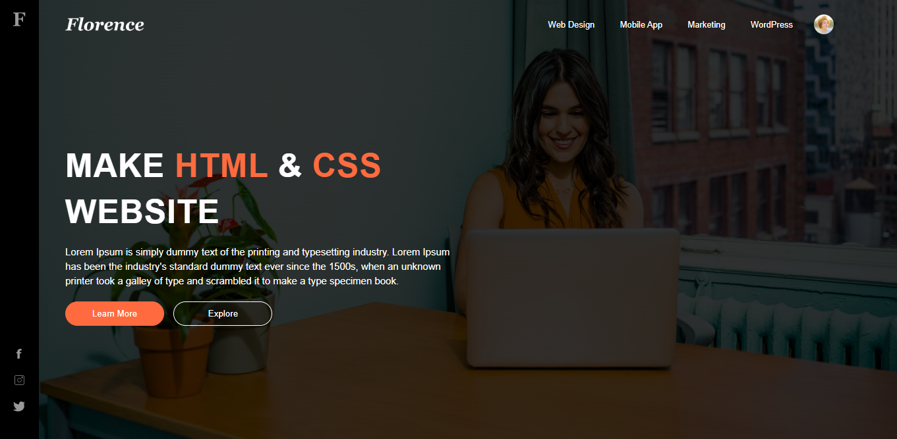

<h1 align="center"> modern-layout-desing </h1>

  <a href="#-tecnologias">Tecnologias</a>&nbsp;&nbsp;&nbsp;|&nbsp;&nbsp;&nbsp;
  <a href="#-projeto">Projeto</a>&nbsp;&nbsp;&nbsp;|&nbsp;&nbsp;&nbsp;
  <a href="#memo-licença">Licença</a>

  

 

  

## 🚀 Tecnologias

Esse projeto foi desenvolvido com as seguintes tecnologias:

- HTML5
- CSS3

## 🔥 Algumas features neste projeto

- Layout moderno com simples CSS
- Menu do estilo sidebar com ícones de redes sociais
- Imagem de background com efeito de fade

## 💻 Projeto

- Esta é uma aplicação muito simples com um layout moderno criada somente com HTML e CSS

## 📝 Licença

Esse projeto está sob a licença MIT.

---
